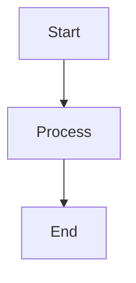

# Implementation Plan: Bilingual Personal Website

## Overview

A bilingual (Arabic + English) personal website with:

- Sidebar profile card (inspired by Minimal Mistakes theme)
- Hash-based routing with markdown content
- Per-page language toggle (EN / عربي)
- Automatic RTL/LTR switching
- Code block syntax highlighting with copy button
- Mermaid diagram rendering
- Image support
- Fully responsive layout (4 breakpoints: mobile, tablet, desktop, large)

All content lives in separate `.md` files, loaded via `fetch()`. A small Ruby script generates listing manifests. Requires any static file server for deployment.

---

## ⚠️ CRITICAL — Read Before Writing Any Code

These four issues WILL break the site if not handled. They are the most common agent implementation failures.

### 1. NEVER open `index.html` as a file — use a local server

This site loads `.md` files via `fetch()`. Browsers block `fetch()` on `file:///` URLs due to CORS security policies. You will see a blank page and console errors like `Access to fetch at 'file:///...' from origin 'null' has been blocked by CORS policy`.

**Every time you test, you MUST start a local server first:**

```bash
# Use any of these:
python3 -m http.server 8000
ruby -run -e httpd . -p 8000
npx serve .

# Then open http://localhost:8000 — NOT the file path
```

Do NOT skip this. Do NOT try to debug "why fetch isn't working" — it's because you're not using a server.

### 2. ALWAYS run `ruby build.rb` after creating blog/post `.md` files

The blogs and posts listing pages read from `_manifest.json` files. These are NOT generated automatically — you must run the build script after adding, editing, or removing any `.md` file inside `pages/blogs/` or `pages/posts/`.

**Correct workflow:**
```bash
# 1. Create blog post file(s)
# 2. Generate manifests
ruby build.rb
# 3. THEN test in browser
```

If you skip this step, the listing page will be empty or show stale data. The individual post URLs (`#blogs/my-post`) will still work (they fetch directly), but the listing page (`#blogs`) will not show the entry.

**When creating sample content for testing**, make sure you create the `.md` files first, THEN run `ruby build.rb`, THEN start the server and test.

### 3. STRICTLY use CSS Logical Properties — never `left`/`right`/`border-left`/`border-right`

This site switches between LTR (English) and RTL (Arabic). If you use physical CSS properties like `left: 0`, `right: 0`, `border-right`, `padding-left`, the Arabic layout WILL break — the sidebar will appear on the wrong side, borders will be on the wrong edge, and spacing will be mirrored incorrectly.

**ALWAYS use logical properties:**

| ❌ WRONG (breaks RTL) | ✅ CORRECT (works both) |
|---|---|
| `left: 0` | `inset-inline-start: 0` |
| `right: 0` | `inset-inline-end: 0` |
| `border-left` | `border-inline-start` |
| `border-right` | `border-inline-end` |
| `padding-left` | `padding-inline-start` |
| `padding-right` | `padding-inline-end` |
| `margin-left` | `margin-inline-start` |
| `margin-right` | `margin-inline-end` |
| `text-align: left` | `text-align: start` |
| `text-align: right` | `text-align: end` |

**The ONE exception:** `transform: translateX(-100%)` for the mobile sidebar slide-out has no logical equivalent. This is the only place where a `body[dir="rtl"]` override is needed (to flip it to `translateX(100%)`). See Step 5c.

### 4. Do NOT skip `postProcessContent()` — tables will overflow on mobile

After setting `contentEl.innerHTML = marked.parse(md)`, you MUST call `postProcessContent(contentEl)` (defined in Step 9l). This function does three critical things:

1. **Wraps `<table>` elements** in `<div class="table-wrapper">` for horizontal scrolling on mobile. Without this, wide tables will break the page layout on phones — content will overflow and create a horizontal scrollbar on the entire page.
2. **Calls `processCodeBlocks()`** for syntax highlighting and copy buttons.
3. **Calls `processMermaidBlocks()`** to render diagrams.

This is already wired into `renderStaticPage()` (Step 9k) and `renderEntry()` (Step 9n). Do NOT remove or skip these calls. The `renderListing()` function (Step 9m) does NOT need it because listing pages don't contain user markdown.

---

## Architecture

```
Project structure:
├── index.html              → engine (HTML + CSS + JS)
├── build.rb                → manifest generator (run after adding posts)
└── pages/
    ├── home.en.md          → static pages (same as before)
    ├── home.ar.md
    ├── publications.en.md
    ├── publications.ar.md
    ├── certifications.en.md
    ├── certifications.ar.md
    ├── experience.en.md
    ├── experience.ar.md
    ├── contact.en.md
    ├── contact.ar.md
    ├── blogs/                        → long-form blog posts
    │   ├── _manifest.json            → auto-generated index of all blog posts
    │   ├── building-this-site.en.md
    │   ├── building-this-site.ar.md
    │   ├── cloud-architecture.en.md  → English only (no .ar = no toggle)
    │   └── kubernetes-deep-dive.en.md
    └── posts/                        → short-form posts/updates
        ├── _manifest.json            → auto-generated index of all posts
        ├── new-certification.en.md
        ├── new-certification.ar.md
        ├── conference-notes.en.md
        └── side-project.en.md

index.html contains:
├── <head>        → fonts, meta, CDN links
├── <style>       → all CSS (no external stylesheet)
├── <body>
│   ├── <aside>   → sidebar (profile card, always visible on desktop)
│   ├── <div>     → main wrapper
│   │   ├── <nav> → top navigation bar + language toggle
│   │   └── <main>→ rendered markdown content area
│   └── <footer>
├── <script>      → CONFIG object, engine code
```

**Two types of content:**

1. **Static pages** (`pages/slug.lang.md`) — publications, experience, contact, etc. Loaded directly by slug.
2. **Collection pages** (`pages/blogs/`, `pages/posts/`) — multiple entries per section. Each entry is its own `.md` file with front matter. A `_manifest.json` file lists all entries for the listing page.

**Adding a new blog post workflow:**
1. Create `pages/blogs/my-new-post.en.md` (and optionally `.ar.md`)
2. Run `ruby build.rb` — it scans the folders and regenerates `_manifest.json`
3. Deploy. Done.

**Content lives in separate `.md` files** loaded via `fetch()`. This means:
- Adding/editing a page = editing a `.md` file (no touching `index.html`)
- Adding a new static page = creating a `.md` file + one line in `CONFIG.pages`
- Adding a new blog/post = creating a `.md` file + running `ruby build.rb`
- Removing a language version = deleting the `.md` file + rerunning `ruby build.rb`
- **Requires a server** (GitHub Pages, Netlify, Vercel, Cloudflare Pages, or local `python3 -m http.server`). Will NOT work by double-clicking `index.html`.

---

## Step-by-Step Implementation

---

### STEP 1: HTML Skeleton

Create the base HTML structure with these elements:

```html
<!DOCTYPE html>
<html lang="en" dir="ltr">
<head>
  <meta charset="UTF-8">
  <meta name="viewport" content="width=device-width, initial-scale=1.0">
  <title>Site Title</title>
  <!-- CDN links go here (Step 2) -->
  <!-- <style> block goes here (Step 5) -->
</head>
<body>

  <!-- Sidebar (Step 3) -->
  <aside class="sidebar" id="sidebar"></aside>
  <div class="sidebar-overlay" id="sidebar-overlay"></div>

  <!-- Main area -->
  <div class="main-wrapper">

    <!-- Top nav bar (Step 4) -->
    <nav>
      <div class="nav-inner">
        <button class="menu-btn" id="menu-btn" aria-label="Toggle menu">☰</button>
        <div class="nav-links" id="nav-links"></div>
        <div class="lang-toggle" id="lang-toggle">
          <button onclick="setLang('en')">EN</button>
          <button onclick="setLang('ar')">عربي</button>
        </div>
      </div>
    </nav>

    <!-- Content area -->
    <main>
      <article class="content" id="content"></article>
    </main>

    <footer></footer>
  </div>

  <!-- <script> block goes here (Steps 6-12) -->
</body>
</html>
```

**Key decisions:**
- `<aside>` is a sibling to `.main-wrapper`, not nested inside it. This allows a clean CSS grid/flex layout.
- The `<button class="menu-btn">` is for mobile sidebar toggle (hidden on desktop).
- `<article>` is used for semantic correctness of the content area.

---

### STEP 2: CDN Dependencies

Add these in the `<head>`, after the `<title>`:

```html
<!-- Markdown parser -->
<script src="https://cdnjs.cloudflare.com/ajax/libs/marked/12.0.1/marked.min.js"></script>

<!-- Syntax highlighting -->
<link rel="stylesheet" href="https://cdnjs.cloudflare.com/ajax/libs/highlight.js/11.9.0/styles/github.min.css">
<link rel="stylesheet" href="https://cdnjs.cloudflare.com/ajax/libs/highlight.js/11.9.0/styles/github-dark.min.css" media="(prefers-color-scheme: dark)">
<script src="https://cdnjs.cloudflare.com/ajax/libs/highlight.js/11.9.0/highlight.min.js"></script>

<!-- Mermaid diagrams -->
<script src="https://cdnjs.cloudflare.com/ajax/libs/mermaid/10.9.0/mermaid.min.js"></script>

<!-- Fonts -->
<link rel="preconnect" href="https://fonts.googleapis.com">
<link href="https://fonts.googleapis.com/css2?family=IBM+Plex+Sans:ital,wght@0,300;0,400;0,500;0,600;1,400&family=Noto+Kufi+Arabic:wght@300;400;500;600&family=IBM+Plex+Mono:wght@400;500&display=swap" rel="stylesheet">
```

**Total CDN payload:** ~150KB gzipped (marked ~8KB, hljs ~40KB, mermaid ~100KB, fonts loaded async).

---

### STEP 3: Sidebar HTML & Rendering

The sidebar is rendered dynamically from a `CONFIG.author` object. This allows the sidebar to adapt when the language changes (e.g., bio text, location label).

**Sidebar HTML structure (generated by JS):**

```html
<aside class="sidebar">
  <div class="sidebar-inner">
    <div class="profile-card">
      
      <h2 class="author-name">Michael Rose</h2>
      <p class="author-bio">Just another boring, tattooed, time traveling, designer.</p>
    </div>
    <div class="author-info">
      <div class="info-item">
        <svg><!-- location pin icon --></svg>
        <span>Buffalo, NY</span>
      </div>
      <div class="info-item">
        <svg><!-- link icon --></svg>
        <a href="...">Made Mistakes</a>
      </div>
    </div>
    <div class="author-links">
      <a href="..." class="social-link" aria-label="Twitter">
        <svg><!-- twitter icon --></svg>
        <span>Twitter</span>
      </a>
      <a href="..." class="social-link" aria-label="GitHub">
        <svg><!-- github icon --></svg>
        <span>GitHub</span>
      </a>
      <!-- more social links -->
    </div>
  </div>
</aside>
```

**CONFIG.author structure:**

```js
author: {
  avatar: 'https://your-image-url.jpg',  // URL to profile photo
  name: { en: 'Your Name', ar: 'اسمك' },
  bio: {
    en: 'Just another boring, tattooed, time traveling, designer.',
    ar: 'مجرد مصمم ممل آخر يسافر عبر الزمن.'
  },
  location: 'Buffalo, NY',
  website: { label: 'Made Mistakes', url: 'https://mademistakes.com' },
  social: [
    { platform: 'twitter',   url: 'https://x.com/handle',        label: 'Twitter' },
    { platform: 'github',    url: 'https://github.com/handle',    label: 'GitHub' },
    { platform: 'instagram', url: 'https://instagram.com/handle', label: 'Instagram' },
    { platform: 'linkedin',  url: 'https://linkedin.com/in/handle', label: 'LinkedIn' },
    { platform: 'email',     url: 'mailto:you@example.com',       label: 'Email' },
  ]
}
```

**`renderSidebar()` implementation:** See Step 9g for the complete JS function.

**SVG Icons:** See Step 8 for the complete `ICONS` map with all SVG markup.

---

### STEP 4: Navigation Bar

**Structure:**
- Sticky top bar
- Left: hamburger menu button (mobile only, toggles sidebar)
- Center: page navigation links (generated from `CONFIG.pages` and `CONFIG.collections`)
- Right: language toggle (EN / عربي), only shown when current page has both languages

**`renderNav()` implementation:** See Step 9h. Iterates both `CONFIG.pages` (static) and `CONFIG.collections` (blogs/posts). Active state highlights the current page or parent collection.

**`renderLangToggle()` implementation:** See Step 9i. Handles three contexts: static pages, collection listings, and individual entries.

**Mobile menu button:**
- On click, toggle `.sidebar-open` class on `<body>`
- When `.sidebar-open`, the sidebar slides in from the left (LTR) or right (RTL) as an overlay
- Clicking outside the sidebar or on a nav link closes it

---

### STEP 5: CSS Styling

Organize CSS into these sections with comments:

#### 5a. Responsive Breakpoint System

The design uses 4 breakpoints with a **mobile-first** approach. All base styles target mobile, then progressively enhance with `min-width` media queries.

```
BREAKPOINTS:
──────────────────────────────────────────────────────────
  Mobile          Tablet          Desktop         Large
  0 – 639px       640 – 1023px    1024 – 1279px   1280px+
──────────────────────────────────────────────────────────
  Sidebar:        Sidebar:        Sidebar:        Sidebar:
  hidden          hidden          visible         visible
  (overlay)       (overlay)       260px           300px

  Nav:            Nav:            Nav:            Nav:
  hamburger +     full links      full links      full links
  scrollable      (wrap if        single row      single row
  links           needed)

  Content:        Content:        Content:        Content:
  16px pad        32px pad        40px pad        48px pad
  full width      max 680px       max 740px       max 820px

  Font base:      Font base:      Font base:      Font base:
  15px            16px            17px            17px

  H1:             H1:             H1:             H1:
  1.6em           1.8em           2.0em           2.2em
──────────────────────────────────────────────────────────
```

#### 5b. CSS Variables (`:root`)

CSS variables use responsive values that get overridden at each breakpoint:

```css
:root {
  /* Colors */
  --bg: #FAFAF8;
  --surface: #FFFFFF;
  --text: #1A1A1A;
  --text-muted: #6B6B6B;
  --accent: #2D5A27;
  --accent-light: #E8F0E7;
  --border: #E5E5E3;

  /* Fonts */
  --font-en: 'IBM Plex Sans', sans-serif;
  --font-ar: 'Noto Kufi Arabic', sans-serif;
  --font-mono: 'IBM Plex Mono', monospace;

  /* Spacing & Sizing — mobile defaults */
  --sidebar-width: 280px;
  --nav-height: 52px;
  --max-content: 100%;
  --content-pad: 16px;
  --radius: 8px;

  /* Typography — mobile defaults */
  --font-size-base: 15px;
  --font-size-h1: 1.6em;
  --font-size-h2: 1.2em;
  --font-size-h3: 1.05em;
  --font-size-nav: 13px;
  --font-size-small: 0.85em;
  --line-height: 1.7;
}
```

#### 5c. Layout — Base (Mobile-First)

All base CSS targets the mobile viewport (0–639px). The sidebar is hidden off-screen, the hamburger menu is visible, and content is full-width.

```
Mobile Layout (0–639px):
┌──────────────────────────────┐
│ [☰]  [Home] [Pub..]  [EN|ع] │  ← nav: hamburger + horizontally scrollable links
├──────────────────────────────┤
│                              │
│         CONTENT              │  ← full width, 16px padding
│         (100%)               │
│                              │
├──────────────────────────────┤
│          FOOTER              │
└──────────────────────────────┘

Sidebar: off-screen overlay, triggered by hamburger
```

**Base body layout:**

```css
body {
  display: flex;
  min-height: 100vh;
  background: var(--bg);
  color: var(--text);
  font-family: var(--font-en);
  font-size: var(--font-size-base);
  line-height: var(--line-height);
  -webkit-font-smoothing: antialiased;
}

body[dir="rtl"] {
  font-family: var(--font-ar);
}
```

**Sidebar — mobile (base/default):**

```css
.sidebar {
  position: fixed;
  top: 0;
  inset-inline-start: 0;   /* left in LTR, right in RTL — handles both automatically */
  z-index: 200;
  width: var(--sidebar-width);
  height: 100vh;
  height: 100dvh;           /* dynamic viewport height for mobile browsers */
  overflow-y: auto;
  background: var(--surface);
  padding: 32px 20px;
  transform: translateX(-100%);    /* hidden off-screen left */
  transition: transform 0.3s cubic-bezier(0.4, 0, 0.2, 1), box-shadow 0.3s ease;
  border-inline-end: 1px solid var(--border);
}

/* RTL: slide off to the right instead */
body[dir="rtl"] .sidebar {
  transform: translateX(100%);
}

/* Sidebar open state */
body.sidebar-open .sidebar {
  transform: translateX(0);
  box-shadow: 4px 0 24px rgba(0, 0, 0, 0.12);
}

/* Dark overlay behind sidebar */
.sidebar-overlay {
  display: none;
  position: fixed;
  inset: 0;
  background: rgba(0, 0, 0, 0.35);
  z-index: 199;
  opacity: 0;
  transition: opacity 0.3s ease;
}

body.sidebar-open .sidebar-overlay {
  display: block;
  opacity: 1;
}
```

**NOTE:** The `<div class="sidebar-overlay" id="sidebar-overlay"></div>` is already included in the HTML skeleton (Step 1, line after `<aside>`). This is a separate element (not a `::after` pseudo-element) so it can receive click events to close the sidebar.

**Main wrapper — mobile (base/default):**

```css
.main-wrapper {
  flex: 1;
  min-width: 0;
  display: flex;
  flex-direction: column;
  width: 100%;   /* full width on mobile since sidebar is overlay */
}
```

**Nav — mobile (base/default):**

```css
nav {
  position: sticky;
  top: 0;
  z-index: 100;
  background: rgba(250, 250, 248, 0.88);
  backdrop-filter: blur(12px);
  -webkit-backdrop-filter: blur(12px);
  border-bottom: 1px solid var(--border);
}

.nav-inner {
  display: flex;
  align-items: center;
  gap: 8px;
  height: var(--nav-height);
  padding: 0 var(--content-pad);
}

.menu-btn {
  display: flex;        /* visible on mobile */
  align-items: center;
  justify-content: center;
  background: none;
  border: 1px solid var(--border);
  border-radius: 6px;
  width: 36px;
  height: 36px;
  cursor: pointer;
  color: var(--text);
  font-size: 18px;
  flex-shrink: 0;
  transition: background 0.2s;
}

.menu-btn:hover {
  background: var(--accent-light);
}

.nav-links {
  display: flex;
  gap: 2px;
  align-items: center;
  overflow-x: auto;        /* horizontally scrollable on mobile */
  -webkit-overflow-scrolling: touch;
  scrollbar-width: none;   /* hide scrollbar */
  flex: 1;
  min-width: 0;
}

.nav-links::-webkit-scrollbar { display: none; }

.nav-links a {
  text-decoration: none;
  color: var(--text-muted);
  font-size: var(--font-size-nav);
  font-weight: 500;
  padding: 6px 10px;
  border-radius: 6px;
  transition: all 0.2s;
  white-space: nowrap;     /* prevent wrapping in scroll container */
  flex-shrink: 0;
  cursor: pointer;
}

.nav-links a:hover { color: var(--text); background: var(--accent-light); }
.nav-links a.active { color: var(--accent); background: var(--accent-light); }
```

**Language toggle — all sizes:**

```css
.lang-toggle {
  display: none;     /* hidden until both languages exist */
  border: 1px solid var(--border);
  border-radius: 8px;
  overflow: hidden;
  flex-shrink: 0;
}

.lang-toggle button {
  background: none;
  border: none;
  padding: 5px 12px;
  font-size: 12px;
  font-weight: 500;
  cursor: pointer;
  color: var(--text-muted);
  transition: all 0.2s;
  font-family: var(--font-en);
}

.lang-toggle button.active {
  background: var(--accent);
  color: white;
}
```

**Content area — mobile (base/default):**

```css
main {
  flex: 1;
  max-width: var(--max-content);
  margin: 0 auto;
  padding: 24px var(--content-pad) 80px;
  width: 100%;
}
```

#### 5d. Layout — Tablet (640px – 1023px)

Sidebar remains an overlay but the content area gets more room. Nav links no longer need the hamburger unless they overflow.

```
Tablet Layout (640–1023px):
┌──────────────────────────────────────┐
│ [☰] [Home] [Pubs] [Certs] ... [EN|ع]│  ← nav: hamburger still visible, links wrap
├──────────────────────────────────────┤
│                                      │
│            CONTENT                   │  ← max-width 680px, centered, 32px padding
│          (max 680px)                 │
│                                      │
├──────────────────────────────────────┤
│             FOOTER                   │
└──────────────────────────────────────┘
```

```css
@media (min-width: 640px) {
  :root {
    --font-size-base: 16px;
    --font-size-h1: 1.8em;
    --font-size-h2: 1.3em;
    --font-size-h3: 1.1em;
    --font-size-nav: 14px;
    --content-pad: 32px;
    --max-content: 680px;
    --nav-height: 56px;
  }

  main {
    padding-top: 36px;
    padding-bottom: 100px;
  }

  /* Nav links can wrap on tablet if there are many pages */
  .nav-links {
    flex-wrap: wrap;
    overflow-x: visible;
    gap: 4px;
  }

  /* Sidebar overlay gets wider */
  .sidebar {
    width: 300px;
    padding: 40px 24px;
  }

  /* Avatar slightly larger */
  .avatar {
    width: 130px;
    height: 130px;
  }
}
```

#### 5e. Layout — Desktop (1024px – 1279px)

The sidebar becomes permanently visible beside the content. The hamburger menu is hidden.

```
Desktop Layout (1024–1279px):
┌──────────────┬───────────────────────────────────────┐
│              │  [Home] [Pubs] [Certs] ...  [EN|عربي] │
│   SIDEBAR    ├───────────────────────────────────────┤
│   (sticky)   │                                       │
│   260px      │             CONTENT                   │
│              │           (max 740px)                  │
│              │                                       │
│              ├───────────────────────────────────────┤
│              │              FOOTER                   │
└──────────────┴───────────────────────────────────────┘
```

```css
@media (min-width: 1024px) {
  :root {
    --font-size-base: 17px;
    --font-size-h1: 2.0em;
    --font-size-h2: 1.35em;
    --font-size-nav: 14px;
    --content-pad: 40px;
    --max-content: 740px;
    --sidebar-width: 260px;
  }

  /* Sidebar: visible, sticky, beside content */
  .sidebar {
    position: sticky;
    top: 0;
    height: 100vh;
    transform: none !important;     /* override mobile slide-out */
    box-shadow: none !important;
    width: var(--sidebar-width);
    flex-shrink: 0;
    padding: 40px 24px;
    background: var(--bg);          /* match page background, not surface */
    border-inline-end: 1px solid var(--border);
  }

  /* Hide mobile-only elements */
  .menu-btn { display: none; }
  .sidebar-overlay { display: none !important; }

  /* Body class has no effect on desktop */
  body.sidebar-open .sidebar {
    box-shadow: none;
  }

  /* Main wrapper shrinks to make room for sidebar */
  .main-wrapper {
    width: calc(100% - var(--sidebar-width));
  }

  main {
    padding-top: 48px;
    padding-bottom: 120px;
  }
}
```

#### 5f. Layout — Large (1280px+)

More breathing room. Wider sidebar, wider content, generous spacing.

```
Large Layout (1280px+):
┌─────────────────┬─────────────────────────────────────────────┐
│                 │  [Home] [Pubs] [Certs] [Exp] ...  [EN|عربي] │
│    SIDEBAR      ├─────────────────────────────────────────────┤
│    (sticky)     │                                             │
│    300px        │               CONTENT                       │
│                 │             (max 820px)                      │
│                 │                                             │
│                 ├─────────────────────────────────────────────┤
│                 │                FOOTER                       │
└─────────────────┴─────────────────────────────────────────────┘
```

```css
@media (min-width: 1280px) {
  :root {
    --font-size-h1: 2.2em;
    --content-pad: 48px;
    --max-content: 820px;
    --sidebar-width: 300px;
  }

  .sidebar {
    padding: 48px 32px;
  }

  /* Avatar larger on big screens */
  .avatar {
    width: 150px;
    height: 150px;
  }
}
```

#### 5g. Sidebar Card Styles

Base (mobile-first) styles for the profile card. These scale up via breakpoint overrides above.

```css
.sidebar-inner {
  display: flex;
  flex-direction: column;
}

.avatar {
  width: 110px;
  height: 110px;
  border-radius: 50%;
  object-fit: cover;
  margin: 0 auto 16px;
  display: block;
  border: 3px solid var(--border);
}

.author-name {
  text-align: center;
  font-size: 1.15em;
  font-weight: 600;
  margin-bottom: 8px;
}

.author-bio {
  text-align: center;
  color: var(--text-muted);
  font-size: var(--font-size-small);
  font-style: italic;
  margin-bottom: 24px;
  line-height: 1.5;
}

.author-info {
  display: flex;
  flex-direction: column;
  gap: 8px;
  margin-bottom: 20px;
}

.info-item {
  display: flex;
  align-items: center;
  gap: 8px;
  font-size: var(--font-size-small);
  color: var(--text-muted);
}

.info-item svg {
  width: 18px;
  height: 18px;
  flex-shrink: 0;
  color: var(--text-muted);
}

.social-link {
  display: flex;
  align-items: center;
  gap: 8px;
  padding: 6px 0;
  font-size: var(--font-size-small);
  color: var(--text-muted);
  text-decoration: none;
  transition: color 0.2s;
}

.social-link:hover { color: var(--accent); }

.social-link svg {
  width: 18px;
  height: 18px;
  flex-shrink: 0;
}
```

#### 5h. Typography & Markdown Content Styles

All typography uses CSS variables so they scale with breakpoints.

```css
/* Note: body[dir="rtl"] { font-family: var(--font-ar); } is already defined in section 5c base styles */

.content h1 {
  font-size: var(--font-size-h1);
  font-weight: 600;
  margin-bottom: 8px;
  letter-spacing: -0.02em;
  line-height: 1.2;
}

.content h2 {
  font-size: var(--font-size-h2);
  font-weight: 600;
  margin-top: 48px;
  margin-bottom: 12px;
  letter-spacing: -0.01em;
}

.content h3 {
  font-size: var(--font-size-h3);
  font-weight: 600;
  margin-top: 32px;
  margin-bottom: 8px;
}

.content p { margin-bottom: 16px; }

.content a {
  color: var(--accent);
  text-decoration: underline;
  text-underline-offset: 3px;
}

/* Images: fluid with max-width constraint */
.content img {
  max-width: 100%;
  height: auto;
  border-radius: var(--radius);
  margin: 24px 0;
  display: block;
}

/* Tables: horizontally scrollable on small screens */
.content .table-wrapper {
  width: 100%;
  overflow-x: auto;
  -webkit-overflow-scrolling: touch;
  margin: 24px 0;
}

.content table {
  width: 100%;
  border-collapse: collapse;
  min-width: 400px;   /* forces horizontal scroll on very narrow screens */
}

.content th, .content td {
  padding: 10px 14px;
  text-align: start;
  border-bottom: 1px solid var(--border);
  white-space: nowrap;     /* prevent cell content from breaking awkwardly */
}

.content th {
  font-weight: 600;
  font-size: var(--font-size-small);
  text-transform: uppercase;
  letter-spacing: 0.05em;
  color: var(--text-muted);
}

/* On tablet+, allow table cells to wrap */
@media (min-width: 640px) {
  .content th, .content td { white-space: normal; }
}

.content ul, .content ol {
  margin-bottom: 16px;
  padding-inline-start: 24px;
}

.content li { margin-bottom: 6px; }

.content blockquote {
  border-inline-start: 3px solid var(--accent);
  padding-inline-start: 20px;
  margin: 24px 0;
  color: var(--text-muted);
  font-style: italic;
}

/* Inline direction overrides for mixed content within a page */
.content [dir="ltr"] { direction: ltr; text-align: left; font-family: var(--font-en); }
.content [dir="rtl"] { direction: rtl; text-align: right; font-family: var(--font-ar); }
```

**IMPORTANT — Table wrapping:** In `postProcessContent()` (Step 9l), after setting `contentEl.innerHTML`, wrap all `<table>` elements in a `<div class="table-wrapper">` so they scroll horizontally on mobile. This is already implemented in the `postProcessContent()` helper function. The code:

```js
contentEl.querySelectorAll('table').forEach(table => {
  const wrapper = document.createElement('div');
  wrapper.className = 'table-wrapper';
  table.parentNode.insertBefore(wrapper, table);
  wrapper.appendChild(table);
});
```

#### 5i. Blog Listing Styles (Card Layout)

```css
.listing-header {
  margin-bottom: 40px;
}

.listing-header h1 {
  font-size: var(--font-size-h1);
  font-weight: 600;
  letter-spacing: -0.02em;
}

/* Blog card grid */
.entry-cards {
  display: grid;
  grid-template-columns: 1fr;
  gap: 24px;
}

@media (min-width: 640px) {
  .entry-cards {
    grid-template-columns: repeat(2, 1fr);
    gap: 28px;
  }
}

@media (min-width: 1280px) {
  .entry-cards { gap: 32px; }
}

.entry-card {
  display: block;
  text-decoration: none;
  color: var(--text);
  background: var(--surface);
  border: 1px solid var(--border);
  border-radius: var(--radius);
  overflow: hidden;
  transition: box-shadow 0.2s, transform 0.2s;
}

.entry-card:hover {
  box-shadow: 0 4px 16px rgba(0, 0, 0, 0.08);
  transform: translateY(-2px);
}

.entry-card-cover {
  width: 100%;
  height: 180px;
  background-size: cover;
  background-position: center;
  background-color: var(--accent-light);   /* fallback if no cover */
}

/* Hide cover section entirely if no image */
.entry-card-cover.no-cover { display: none; }

.entry-card-body {
  padding: 20px;
}

.entry-card-meta {
  display: flex;
  align-items: center;
  gap: 12px;
  margin-bottom: 8px;
}

.entry-card-meta time {
  font-size: var(--font-size-small);
  color: var(--text-muted);
}

.entry-card-title {
  font-size: 1.15em;
  font-weight: 600;
  margin-bottom: 8px;
  line-height: 1.3;
}

.entry-card-excerpt {
  font-size: var(--font-size-small);
  color: var(--text-muted);
  line-height: 1.5;
  margin-bottom: 12px;
  /* Clamp to 3 lines */
  display: -webkit-box;
  -webkit-line-clamp: 3;
  -webkit-box-orient: vertical;
  overflow: hidden;
}

.entry-card-tags {
  display: flex;
  flex-wrap: wrap;
  gap: 6px;
}

.tag {
  font-size: 11px;
  font-weight: 500;
  padding: 2px 8px;
  border-radius: 4px;
  background: var(--accent-light);
  color: var(--accent);
  text-transform: lowercase;
}
```

#### 5j. Post Listing Styles (Timeline Layout)

```css
.post-list {
  display: flex;
  flex-direction: column;
  gap: 0;
}

.post-item {
  display: flex;
  gap: 16px;
  padding: 20px 0;
  text-decoration: none;
  color: var(--text);
  border-bottom: 1px solid var(--border);
  transition: background 0.2s;
  align-items: flex-start;
}

.post-item:first-child { padding-top: 0; }

.post-item:hover {
  background: var(--accent-light);
  margin-inline: -12px;
  padding-inline: 12px;
  border-radius: var(--radius);
}

.post-item-date {
  font-size: var(--font-size-small);
  color: var(--text-muted);
  white-space: nowrap;
  min-width: 100px;
  padding-top: 2px;
}

/* Stack date above content on mobile */
@media (max-width: 639px) {
  .post-item {
    flex-direction: column;
    gap: 4px;
  }
  .post-item-date { min-width: auto; }
}

.post-item-body { flex: 1; min-width: 0; }

.post-item-title {
  font-size: 1em;
  font-weight: 600;
  margin-bottom: 4px;
  line-height: 1.3;
}

.post-item-excerpt {
  font-size: var(--font-size-small);
  color: var(--text-muted);
  line-height: 1.5;
  /* Clamp to 2 lines */
  display: -webkit-box;
  -webkit-line-clamp: 2;
  -webkit-box-orient: vertical;
  overflow: hidden;
}
```

#### 5k. Individual Entry Styles

```css
/* Back link at top of entry */
.back-link {
  display: inline-flex;
  align-items: center;
  gap: 6px;
  font-size: var(--font-size-small);
  color: var(--text-muted);
  text-decoration: none;
  margin-bottom: 24px;
  transition: color 0.2s;
}

.back-link:hover { color: var(--accent); }

/* Cover image at top of entry */
.entry-cover {
  width: 100%;
  max-height: 400px;
  object-fit: cover;
  border-radius: var(--radius);
  margin-bottom: 24px;
}

/* Metadata bar below title */
.entry-meta {
  display: flex;
  align-items: center;
  flex-wrap: wrap;
  gap: 12px;
  margin-bottom: 32px;
  padding-bottom: 20px;
  border-bottom: 1px solid var(--border);
}

.entry-meta time {
  font-size: var(--font-size-small);
  color: var(--text-muted);
}

.entry-tags {
  display: flex;
  flex-wrap: wrap;
  gap: 6px;
}
```

#### 5l. Code Block Styles

```css
/* Container wrapper for code blocks */
.code-block-wrapper {
  position: relative;
  margin: 24px 0;
}

/* Copy button */
.code-copy-btn {
  position: absolute;
  top: 8px;
  inset-inline-end: 8px;   /* right in LTR, left in RTL */
  background: rgba(255, 255, 255, 0.1);
  border: 1px solid rgba(255, 255, 255, 0.15);
  color: #999;
  font-size: 12px;
  font-family: var(--font-en);
  padding: 4px 10px;
  border-radius: 4px;
  cursor: pointer;
  transition: all 0.2s;
  z-index: 2;
}

.code-copy-btn:hover {
  background: rgba(255, 255, 255, 0.2);
  color: #fff;
}

.code-copy-btn.copied {
  color: #4ade80;
  border-color: #4ade80;
}

/* Pre/code blocks — must scroll horizontally on small screens */
.content pre {
  background: #1A1A1A;
  color: #E5E5E3;
  padding: 16px;
  border-radius: var(--radius);
  overflow-x: auto;
  -webkit-overflow-scrolling: touch;
  font-size: 0.88em;
  line-height: 1.6;
  max-width: 100%;        /* prevent overflow on mobile */
}

/* Larger padding on bigger screens */
@media (min-width: 640px) {
  .content pre { padding: 20px; font-size: 0.9em; }
}

.content pre code {
  background: none;
  padding: 0;
  color: inherit;
  font-family: var(--font-mono);
  white-space: pre;       /* preserve formatting, allow horizontal scroll */
  word-break: normal;
  overflow-wrap: normal;
}

/* Inline code */
.content code {
  font-family: var(--font-mono);
  background: var(--accent-light);
  padding: 2px 6px;
  border-radius: 4px;
  font-size: 0.88em;
  word-break: break-word;  /* prevent long inline code from overflowing */
}
```

#### 5m. Mermaid Styles

```css
.mermaid-wrapper {
  margin: 24px 0;
  display: flex;
  justify-content: center;
  overflow-x: auto;            /* scroll if diagram is wider than viewport */
  -webkit-overflow-scrolling: touch;
}

.mermaid-wrapper svg {
  max-width: 100%;
  height: auto;
}

/* On mobile, allow mermaid diagrams to overflow and scroll */
@media (max-width: 639px) {
  .mermaid-wrapper {
    justify-content: flex-start;  /* align to start so user knows to scroll */
  }
}
```

#### 5n. Page Transition Animation

```css
.content {
  animation: fadeIn 0.3s ease;
}

@keyframes fadeIn {
  from { opacity: 0; transform: translateY(8px); }
  to { opacity: 1; transform: translateY(0); }
}

/* Reduce motion for users who prefer it */
@media (prefers-reduced-motion: reduce) {
  .content { animation: none; }
  .sidebar { transition: none; }
  .sidebar-overlay { transition: none; }
}
```

#### 5o. Footer Responsive Styles

```css
footer {
  text-align: center;
  padding: 24px var(--content-pad);
  color: var(--text-muted);
  font-size: var(--font-size-small);
  border-top: 1px solid var(--border);
  margin-top: auto;
}

@media (min-width: 640px) {
  footer { padding: 32px var(--content-pad); }
}
```
```

---

### STEP 6: CONFIG Object

```js
const CONFIG = {
  siteName: 'Your Name',
  defaultLang: 'en',
  langDir: { en: 'ltr', ar: 'rtl' },
  langFont: {
    en: "'IBM Plex Sans', sans-serif",
    ar: "'Noto Kufi Arabic', sans-serif"
  },

  author: {
    avatar: 'https://via.placeholder.com/200',
    name: { en: 'Your Name', ar: 'اسمك' },
    bio: {
      en: 'Just another boring, tattooed, time traveling, designer.',
      ar: 'مجرد مصمم ممل آخر يسافر عبر الزمن.'
    },
    location: 'Buffalo, NY',
    website: { label: 'Made Mistakes', url: 'https://mademistakes.com' },
    social: [
      { platform: 'twitter',   url: 'https://x.com/handle',      label: 'Twitter' },
      { platform: 'github',    url: 'https://github.com/handle',  label: 'GitHub' },
      { platform: 'instagram', url: 'https://instagram.com/handle', label: 'Instagram' },
    ]
  },

  // Static pages: [slug, enLabel, arLabel]
  // These load from pages/slug.en.md and pages/slug.ar.md
  pages: [
    ['home',           'Home',           'الرئيسية'],
    ['publications',   'Publications',   'المنشورات'],
    ['certifications', 'Certifications', 'الشهادات'],
    ['experience',     'Experience',     'الخبرات'],
    ['contact',        'Contact',        'تواصل'],
  ],

  // Collections: [slug, enLabel, arLabel, type]
  // These load from pages/slug/_manifest.json
  // 'type' controls the listing style:
  //   'blog' = card layout with cover images, excerpts, read more links
  //   'post' = compact timeline/feed layout
  collections: [
    ['blogs', 'Blogs', 'المدونة', 'blog'],
    ['posts', 'Posts', 'المقالات', 'post'],
  ]
};
```

**How `pages` vs `collections` differ:**

| | Static pages | Collections |
|---|---|---|
| Config | `CONFIG.pages` | `CONFIG.collections` |
| Files | `pages/slug.lang.md` | `pages/slug/*.lang.md` + `_manifest.json` |
| Route | `#slug` | `#slug` (listing) and `#slug/entry-slug` (individual) |
| Content | Single markdown file | Multiple entries, each with front matter |
| Direction | Per-language file suffix | Per-language file suffix |
| Nav link | Always shows | Always shows (links to listing page) |

**Both** `pages` and `collections` appear in the nav bar. The engine iterates both arrays when building navigation.

---

### STEP 7: Content Files & Blog/Post System

The site has **two types of content**:

#### 7a. Static Pages

Regular pages live directly in `pages/`. Naming convention: `slug.lang.md`.

```
pages/
├── home.en.md
├── home.ar.md
├── publications.en.md
├── publications.ar.md
├── certifications.en.md
├── certifications.ar.md
├── experience.en.md
├── experience.ar.md
├── contact.en.md
└── contact.ar.md
```

**Rules:**
- If both `slug.en.md` and `slug.ar.md` exist → language toggle shows
- If only one exists → no toggle, renders in the available language
- `.en.md` → LTR direction, English font
- `.ar.md` → RTL direction, Arabic font
- No front matter is required for static pages. Direction is determined by the file suffix.

**Example (`pages/experience.en.md`):**

```markdown
# Experience

## Senior Engineer — Company Name
*Jan 2022 – Present*

Describe your role, responsibilities, and key achievements.
```

#### 7b. Collection Pages (Blogs & Posts)

Blog entries and post entries live in their own subfolders. Each entry is a separate `.md` file **with front matter**.

```
pages/
├── blogs/
│   ├── _manifest.json                  ← auto-generated (see Step 7d)
│   ├── building-this-site.en.md
│   ├── building-this-site.ar.md
│   ├── cloud-architecture.en.md        ← English only
│   └── kubernetes-deep-dive.en.md
└── posts/
    ├── _manifest.json                  ← auto-generated
    ├── new-certification.en.md
    ├── new-certification.ar.md
    ├── conference-notes.en.md
    └── side-project.en.md
```

**File naming convention:** `slug.lang.md` inside the collection folder. The slug becomes the URL: `#blogs/building-this-site`.

#### 7c. Front Matter for Collection Entries

Every `.md` file inside `blogs/` or `posts/` **must** have YAML front matter at the top:

```markdown
---
title: How I Built This Site
date: 2026-02-15
excerpt: A walkthrough of building a simple bilingual static site with just HTML and Markdown.
tags: [web, tutorial, bilingual]
cover: https://example.com/images/site-screenshot.jpg
---

# How I Built This Site

The full content of the blog post starts here...
```

**Front matter fields:**

| Field | Required | Description |
|---|---|---|
| `title` | **Yes** | Display title shown on listing page and at top of post |
| `date` | **Yes** | Publication date in `YYYY-MM-DD` format. Used for sorting (newest first) |
| `excerpt` | **Yes** | Short description (1–2 sentences) shown on listing page cards |
| `tags` | No | Array of tag strings for filtering/display. Example: `[web, tutorial]` |
| `cover` | No | URL to cover image shown on listing card and at top of post |

**Example blog entry (`pages/blogs/building-this-site.en.md`):**

```markdown
---
title: How I Built This Site
date: 2026-02-15
excerpt: A walkthrough of building a simple bilingual static site with just HTML and Markdown — zero frameworks, zero build tools.
tags: [web, tutorial]
---

# How I Built This Site

I wanted a personal website that was dead simple to maintain...

## The Requirements

- Bilingual (Arabic + English)
- Markdown-based content
- No build step

## The Solution

A single `index.html` that loads `.md` files via `fetch()`...
```

**Example blog entry — Arabic version (`pages/blogs/building-this-site.ar.md`):**

```markdown
---
title: كيف بنيت هذا الموقع
date: 2026-02-15
excerpt: شرح خطوة بخطوة لبناء موقع ثنائي اللغة باستخدام HTML و Markdown فقط.
tags: [ويب, شرح]
---

# كيف بنيت هذا الموقع

أردت موقعاً شخصياً بسيطاً وسهل الصيانة...
```

**Example short post (`pages/posts/new-certification.en.md`):**

```markdown
---
title: New Certification!
date: 2026-02-15
excerpt: Just earned my AWS Solutions Architect certification.
tags: [career, aws]
---

# New Certification!

Just earned my new certification! Excited to apply what I've learned. The exam covered...
```

#### 7d. Manifest Files (`_manifest.json`)

Each collection folder has a `_manifest.json` file that lists all entries. This is how the engine knows which files exist without scanning directories (which is impossible with static hosting).

**`pages/blogs/_manifest.json`:**

```json
{
  "entries": [
    {
      "slug": "building-this-site",
      "langs": {
        "en": {
          "title": "How I Built This Site",
          "date": "2026-02-15",
          "excerpt": "A walkthrough of building a simple bilingual static site with just HTML and Markdown.",
          "tags": ["web", "tutorial"],
          "cover": null
        },
        "ar": {
          "title": "كيف بنيت هذا الموقع",
          "date": "2026-02-15",
          "excerpt": "شرح خطوة بخطوة لبناء موقع ثنائي اللغة باستخدام HTML و Markdown فقط.",
          "tags": ["ويب", "شرح"],
          "cover": null
        }
      }
    },
    {
      "slug": "cloud-architecture",
      "langs": {
        "en": {
          "title": "Getting Started with Cloud Architecture",
          "date": "2026-01-20",
          "excerpt": "Notes on designing scalable systems in the cloud.",
          "tags": ["cloud", "architecture"],
          "cover": null
        }
      }
    }
  ]
}
```

**Key points:**
- `entries` is sorted by date (newest first) — the build script handles this
- Each entry has a `slug` (matches filename) and a `langs` object
- `langs` only contains keys for languages that have a `.md` file
- If an entry has both `en` and `ar`, the listing page shows the title/excerpt in the current language
- If an entry only has `en`, the listing page always shows English metadata regardless of current language
- The manifest contains all metadata needed for the listing page, so the engine does NOT need to fetch individual `.md` files just to render the listing

#### 7e. Build Script (`build.rb`)

This Ruby script scans `pages/blogs/` and `pages/posts/`, reads front matter from each `.md` file, and generates the `_manifest.json` files. Run it after adding/editing/removing any blog or post file.

**Why Ruby:** Clean syntax, built-in YAML and JSON libraries, pre-installed on macOS, no external gems needed.

**`build.rb`:**

```ruby
#!/usr/bin/env ruby
# frozen_string_literal: true

# Generates _manifest.json for blogs/ and posts/ collections.
# Run after adding, editing, or removing any blog or post .md file.
#
# Usage: ruby build.rb
# Requirements: Ruby 2.7+ (uses built-in yaml and json, no gems needed)

require 'json'
require 'yaml'

COLLECTIONS = %w[pages/blogs pages/posts].freeze

def parse_front_matter(filepath)
  content = File.read(filepath, encoding: 'utf-8')
  return {} unless content.start_with?('---')

  parts = content.split(/^---\s*$/, 3)
  return {} if parts.length < 3

  YAML.safe_load(parts[1]) || {}
rescue Psych::SyntaxError => e
  warn "  ⚠ YAML error in #{filepath}: #{e.message}"
  {}
end

def extract_slug_and_lang(filename)
  # "building-this-site.en.md" → slug: "building-this-site", lang: "en"
  basename = File.basename(filename, '.md')  # "building-this-site.en"
  parts = basename.rpartition('.')            # ["building-this-site", ".", "en"]
  return nil if parts[1].empty?              # no dot found

  slug = parts[0]
  lang = parts[2]
  return nil unless %w[en ar].include?(lang)

  [slug, lang]
end

def generate_manifest(dir)
  output_path = File.join(dir, '_manifest.json')
  entries = {} # slug => { langs: { "en" => {...}, "ar" => {...} } }

  Dir.glob(File.join(dir, '*.*.md')).each do |filepath|
    result = extract_slug_and_lang(filepath)
    next unless result

    slug, lang = result
    meta = parse_front_matter(filepath)

    # Validate required fields
    unless meta['title'] && meta['date']
      warn "  ⚠ Skipping #{filepath}: missing required 'title' or 'date' in front matter"
      next
    end

    entries[slug] ||= { 'slug' => slug, 'langs' => {} }
    entries[slug]['langs'][lang] = {
      'title'   => meta['title'].to_s,
      'date'    => meta['date'].to_s,
      'excerpt' => (meta['excerpt'] || '').to_s,
      'tags'    => meta['tags'].is_a?(Array) ? meta['tags'].map(&:to_s) : nil,
      'cover'   => meta['cover']&.to_s
    }
  end

  # Sort entries by date descending (newest first)
  sorted = entries.values.sort_by do |entry|
    date_str = entry['langs'].values.first&.dig('date') || '0000-00-00'
    date_str
  end.reverse

  manifest = { 'entries' => sorted }

  File.write(output_path, JSON.pretty_generate(manifest))
  puts "  ✓ Generated #{output_path} (#{sorted.length} entries)"
end

puts 'Building manifests...'
puts

COLLECTIONS.each do |dir|
  if Dir.exist?(dir)
    puts "Scanning #{dir}/"
    generate_manifest(dir)
  else
    puts "Skipping #{dir}/ (directory not found)"
  end
  puts
end

puts 'Done!'
```

**Usage:**

```bash
# After adding a new blog post:
ruby build.rb

# Output:
# Building manifests...
#
# Scanning pages/blogs/
#   ✓ Generated pages/blogs/_manifest.json (3 entries)
#
# Scanning pages/posts/
#   ✓ Generated pages/posts/_manifest.json (2 entries)
#
# Done!
```

**Error handling:** The script warns and skips files with:
- Missing front matter
- YAML parse errors (e.g. unescaped colons in Arabic text)
- Missing required `title` or `date` fields

**Automation options:**
- **Git hook:** Add `ruby build.rb` to `.git/hooks/pre-commit`
- **GitHub Action:** Add a step that runs `ruby build.rb` and commits the updated manifests
- **Manually:** Just run `ruby build.rb` before deploying

**YAML front matter edge cases handled by Ruby's `YAML.safe_load`:**
- Colons in titles: `title: "My title: with colons"` (must be quoted)
- Arabic text: `title: "كيف بنيت هذا الموقع"` (works with quotes)
- Multi-word tags: `tags: [web dev, cloud architecture]`
- Dates as strings: `date: 2026-02-15` (Ruby YAML may parse as Date object, `.to_s` normalizes it)

#### 7f. Markdown Features (All Content Types)

**Mermaid blocks:** Use fenced code blocks with the `mermaid` language tag:

````

````

These will be detected and rendered in Step 10.

**Images:** Standard markdown image syntax:

```

```

No special handling needed — the `` tag is styled via `.content img` CSS.

**Mixed direction within a page:** Use inline HTML `<div>` blocks:

```markdown
نص عربي هنا.

<div dir="ltr">

This section is left-to-right English.

</div>

رجعنا للعربية.
```

#### 7g. Complete Workflow — Adding a New Blog Post

**Step 1:** Create the file:

```bash
touch pages/blogs/my-new-post.en.md
```

**Step 2:** Add front matter and content:

```markdown
---
title: My New Blog Post
date: 2026-03-01
excerpt: A short description that appears on the listing page.
tags: [topic1, topic2]
---

# My New Blog Post

Write your content here...
```

**Step 3 (optional):** Create Arabic version:

```bash
touch pages/blogs/my-new-post.ar.md
```

**Step 4:** Rebuild manifests:

```bash
ruby build.rb
```

**Step 5:** Deploy. The new post automatically appears on the blogs listing page and has its own URL at `#blogs/my-new-post`.

**To remove a post:** Delete the `.md` file(s) and rerun `ruby build.rb`.

---

### STEP 8: SVG Icon Map

All icons are Lucide-style (24x24 viewBox, stroke-based, `currentColor`). Copy these exactly:

```js
const ICONS = {
  location: '<svg xmlns="http://www.w3.org/2000/svg" width="18" height="18" viewBox="0 0 24 24" fill="none" stroke="currentColor" stroke-width="2" stroke-linecap="round" stroke-linejoin="round"><path d="M21 10c0 7-9 13-9 13s-9-6-9-13a9 9 0 0 1 18 0z"></path><circle cx="12" cy="10" r="3"></circle></svg>',

  link: '<svg xmlns="http://www.w3.org/2000/svg" width="18" height="18" viewBox="0 0 24 24" fill="none" stroke="currentColor" stroke-width="2" stroke-linecap="round" stroke-linejoin="round"><path d="M10 13a5 5 0 0 0 7.54.54l3-3a5 5 0 0 0-7.07-7.07l-1.72 1.71"></path><path d="M14 11a5 5 0 0 0-7.54-.54l-3 3a5 5 0 0 0 7.07 7.07l1.71-1.71"></path></svg>',

  twitter: '<svg xmlns="http://www.w3.org/2000/svg" width="18" height="18" viewBox="0 0 24 24" fill="none" stroke="currentColor" stroke-width="2" stroke-linecap="round" stroke-linejoin="round"><path d="M4 4l11.733 16h4.267l-11.733 -16h-4.267z"></path><path d="M4 20l6.768 -6.768"></path><path d="M20 4l-6.768 6.768"></path></svg>',

  github: '<svg xmlns="http://www.w3.org/2000/svg" width="18" height="18" viewBox="0 0 24 24" fill="none" stroke="currentColor" stroke-width="2" stroke-linecap="round" stroke-linejoin="round"><path d="M15 22v-4a4.8 4.8 0 0 0-1-3.5c3 0 6-2 6-5.5.08-1.25-.27-2.48-1-3.5.28-1.15.28-2.35 0-3.5 0 0-1 0-3 1.5-2.64-.5-5.36-.5-8 0C6 2 5 2 5 2c-.3 1.15-.3 2.35 0 3.5A5.403 5.403 0 0 0 4 9c0 3.5 3 5.5 6 5.5-.39.49-.68 1.05-.85 1.65-.17.6-.22 1.23-.15 1.85v4"></path><path d="M9 18c-4.51 2-5-2-7-2"></path></svg>',

  instagram: '<svg xmlns="http://www.w3.org/2000/svg" width="18" height="18" viewBox="0 0 24 24" fill="none" stroke="currentColor" stroke-width="2" stroke-linecap="round" stroke-linejoin="round"><rect width="20" height="20" x="2" y="2" rx="5" ry="5"></rect><path d="M16 11.37A4 4 0 1 1 12.63 8 4 4 0 0 1 16 11.37z"></path><line x1="17.5" x2="17.51" y1="6.5" y2="6.5"></line></svg>',

  linkedin: '<svg xmlns="http://www.w3.org/2000/svg" width="18" height="18" viewBox="0 0 24 24" fill="none" stroke="currentColor" stroke-width="2" stroke-linecap="round" stroke-linejoin="round"><path d="M16 8a6 6 0 0 1 6 6v7h-4v-7a2 2 0 0 0-2-2 2 2 0 0 0-2 2v7h-4v-7a6 6 0 0 1 6-6z"></path><rect width="4" height="12" x="2" y="9"></rect><circle cx="4" cy="4" r="2"></circle></svg>',

  email: '<svg xmlns="http://www.w3.org/2000/svg" width="18" height="18" viewBox="0 0 24 24" fill="none" stroke="currentColor" stroke-width="2" stroke-linecap="round" stroke-linejoin="round"><rect width="20" height="16" x="2" y="4" rx="2"></rect><path d="m22 7-8.97 5.7a1.94 1.94 0 0 1-2.06 0L2 7"></path></svg>',

  copy: '<svg xmlns="http://www.w3.org/2000/svg" width="14" height="14" viewBox="0 0 24 24" fill="none" stroke="currentColor" stroke-width="2" stroke-linecap="round" stroke-linejoin="round"><rect width="14" height="14" x="8" y="8" rx="2" ry="2"></rect><path d="M4 16c-1.1 0-2-.9-2-2V4c0-1.1.9-2 2-2h10c1.1 0 2 .9 2 2"></path></svg>',

  check: '<svg xmlns="http://www.w3.org/2000/svg" width="14" height="14" viewBox="0 0 24 24" fill="none" stroke="currentColor" stroke-width="2" stroke-linecap="round" stroke-linejoin="round"><polyline points="20 6 9 17 4 12"></polyline></svg>',

  arrowLeft: '<svg xmlns="http://www.w3.org/2000/svg" width="16" height="16" viewBox="0 0 24 24" fill="none" stroke="currentColor" stroke-width="2" stroke-linecap="round" stroke-linejoin="round"><path d="m12 19-7-7 7-7"></path><path d="M19 12H5"></path></svg>',

  menu: '<svg xmlns="http://www.w3.org/2000/svg" width="20" height="20" viewBox="0 0 24 24" fill="none" stroke="currentColor" stroke-width="2" stroke-linecap="round" stroke-linejoin="round"><line x1="4" x2="20" y1="12" y2="12"></line><line x1="4" x2="20" y1="6" y2="6"></line><line x1="4" x2="20" y1="18" y2="18"></line></svg>',
};
```

**Notes:**
- All icons inherit color via `currentColor` — they'll match text color automatically
- `copy` and `check` are 14×14 (used in the small copy button)
- `arrowLeft` is used for the "← Back to Blogs" link in individual entries
- `menu` is the hamburger icon for the mobile menu button
- The hamburger button in Step 1 HTML should use: `<button class="menu-btn" id="menu-btn" aria-label="Toggle menu">${ICONS.menu}</button>` — but since the HTML is static, either inline the SVG directly in the HTML, or set `menuBtn.innerHTML = ICONS.menu` in the init script.

---

### STEP 9: Engine — Core Functions

#### 9a. State Variables

```js
let currentLang = CONFIG.defaultLang;
let currentPage = 'home';       // current route: 'home', 'blogs', 'blogs/my-post', etc.
let pageCache = {};              // caches fetched markdown by path
let availableFiles = {};         // static pages: { home: { en: true, ar: true } }
let manifests = {};              // collection manifests: { blogs: { entries: [...] }, posts: { entries: [...] } }
try { currentLang = localStorage.getItem('lang') || CONFIG.defaultLang; } catch(e) {}
```

#### 9b. `fetchMd(path, lang)` — Fetch a markdown file with caching

Updated to handle both static pages and collection entries:

```js
async function fetchMd(path, lang) {
  // path can be:
  //   'home'                  → fetches pages/home.en.md
  //   'blogs/my-post'         → fetches pages/blogs/my-post.en.md
  const key = path + '.' + lang;
  if (pageCache[key] !== undefined) return pageCache[key];
  try {
    const res = await fetch('pages/' + path + '.' + lang + '.md');
    if (!res.ok) throw new Error('Not found');
    const text = await res.text();
    pageCache[key] = text;
    return text;
  } catch {
    pageCache[key] = null;
    return null;
  }
}
```

#### 9c. `parseFrontMatter(text)` — Extract front matter from markdown

```js
function parseFrontMatter(text) {
  const match = text.match(/^---\n([\s\S]*?)\n---\n?([\s\S]*)$/);
  if (!match) return { meta: {}, body: text };
  const meta = {};
  match[1].split('\n').forEach(line => {
    const colonIndex = line.indexOf(':');
    if (colonIndex === -1) return;
    const key = line.slice(0, colonIndex).trim();
    let value = line.slice(colonIndex + 1).trim();
    // Remove surrounding quotes
    if ((value.startsWith('"') && value.endsWith('"')) ||
        (value.startsWith("'") && value.endsWith("'"))) {
      value = value.slice(1, -1);
    }
    // Parse arrays: [tag1, tag2] → ['tag1', 'tag2']
    if (value.startsWith('[') && value.endsWith(']')) {
      value = value.slice(1, -1).split(',').map(s => s.trim());
    }
    meta[key] = value;
  });
  return { meta, body: match[2] };
}
```

**Used for:** Stripping front matter from collection entries before rendering. The listing page gets metadata from the manifest, but when rendering an individual entry, front matter must be removed so it doesn't appear as raw text.

#### 9d. `detectAvailableFiles()` — Startup detection

Now handles BOTH static pages and collection manifests:

```js
async function detectAvailableFiles() {
  const checks = [];

  // 1. Probe static pages
  for (const [slug] of CONFIG.pages) {
    availableFiles[slug] = {};
    for (const lang of ['en', 'ar']) {
      checks.push(
        fetchMd(slug, lang).then(result => {
          availableFiles[slug][lang] = result !== null;
        })
      );
    }
  }

  // 2. Fetch collection manifests
  for (const [slug] of CONFIG.collections) {
    checks.push(
      fetch('pages/' + slug + '/_manifest.json')
        .then(res => {
          if (!res.ok) throw new Error('Not found');
          return res.json();
        })
        .then(data => {
          manifests[slug] = data;
        })
        .catch(() => {
          manifests[slug] = { entries: [] };
        })
    );
  }

  await Promise.all(checks);
}
```

**After this completes:**
- `availableFiles` knows which static pages exist in which languages
- `manifests` has the full listing data for blogs and posts (no further requests needed for listing pages)
- `pageCache` has all static page content pre-cached

#### 9e. `hasPage(slug, lang)`

```js
function hasPage(slug, lang) {
  return availableFiles[slug] && availableFiles[slug][lang] === true;
}
```

#### 9f. `setLang(lang)`

```js
function setLang(lang) {
  currentLang = lang;
  try { localStorage.setItem('lang', lang); } catch(e) {}
  route();  // re-render current page in the new language
}
```

#### 9g. `renderSidebar()`

```js
function renderSidebar() {
  const a = CONFIG.author;
  const lang = currentLang;
  const name = a.name[lang] || a.name.en || '';
  const bio = a.bio[lang] || a.bio.en || '';

  let socialHtml = '';
  for (const s of a.social) {
    const icon = ICONS[s.platform] || ICONS.link;
    socialHtml += `<a href="${s.url}" class="social-link" target="_blank" rel="noopener" aria-label="${s.label}">${icon}<span>${s.label}</span></a>`;
  }

  const html = `
    <div class="sidebar-inner">
      <div class="profile-card">
        
        <h2 class="author-name">${name}</h2>
        <p class="author-bio">${bio}</p>
      </div>
      <div class="author-info">
        ${a.location ? `<div class="info-item">${ICONS.location}<span>${a.location}</span></div>` : ''}
        ${a.website ? `<div class="info-item">${ICONS.link}<a href="${a.website.url}" target="_blank" rel="noopener">${a.website.label}</a></div>` : ''}
      </div>
      <div class="author-links">
        ${socialHtml}
      </div>
    </div>
  `;

  document.getElementById('sidebar').innerHTML = html;
}
```

#### 9h. `renderNav()`

```js
function renderNav() {
  const nav = document.getElementById('nav-links');
  nav.innerHTML = '';

  const base = currentPage.split('/')[0]; // 'blogs/my-post' → 'blogs'

  // Static pages
  for (const [slug, enLabel, arLabel] of CONFIG.pages) {
    if (!hasPage(slug, 'en') && !hasPage(slug, 'ar')) continue;
    const a = document.createElement('a');
    a.href = '#' + slug;
    a.textContent = currentLang === 'ar' ? arLabel : enLabel;
    if (base === slug) a.classList.add('active');
    nav.appendChild(a);
  }

  // Collection pages
  for (const [slug, enLabel, arLabel] of CONFIG.collections) {
    const manifest = manifests[slug];
    if (!manifest || manifest.entries.length === 0) continue;
    const a = document.createElement('a');
    a.href = '#' + slug;
    a.textContent = currentLang === 'ar' ? arLabel : enLabel;
    if (base === slug) a.classList.add('active');
    nav.appendChild(a);
  }
}
```

#### 9i. `renderLangToggle()`

```js
function entryHasBothLangs(collectionSlug, entrySlug) {
  const manifest = manifests[collectionSlug];
  if (!manifest) return false;
  const entry = manifest.entries.find(e => e.slug === entrySlug);
  if (!entry) return false;
  return !!(entry.langs.en && entry.langs.ar);
}

function renderLangToggle() {
  const toggle = document.getElementById('lang-toggle');
  const segments = currentPage.split('/');
  const base = segments[0];
  const child = segments[1] || null;

  let showToggle = false;

  const isCollection = CONFIG.collections.some(([slug]) => slug === base);

  if (isCollection && child) {
    // Individual entry: check manifest for both langs
    showToggle = entryHasBothLangs(base, child);
  } else if (isCollection) {
    // Listing page: always show toggle (listing adapts to language)
    showToggle = true;
  } else {
    // Static page: check availableFiles
    showToggle = hasPage(base, 'en') && hasPage(base, 'ar');
  }

  toggle.style.display = showToggle ? 'flex' : 'none';

  const buttons = toggle.querySelectorAll('button');
  buttons[0].classList.toggle('active', currentLang === 'en');
  buttons[1].classList.toggle('active', currentLang === 'ar');
}
```

#### 9j. `route()` — Updated router

The router now parses the hash into segments to determine what to render:

```js
async function route() {
  const hash = location.hash.replace('#', '') || 'home';
  currentPage = hash;

  // Parse route segments
  const segments = hash.split('/');
  const base = segments[0];             // 'home', 'blogs', 'posts', etc.
  const child = segments[1] || null;    // 'my-post' or null

  // Determine what type of page this is
  const isCollection = CONFIG.collections.some(([slug]) => slug === base);

  if (isCollection && child) {
    // Individual entry: #blogs/my-post
    await renderEntry(base, child);
  } else if (isCollection) {
    // Listing page: #blogs
    renderListing(base);
  } else {
    // Static page: #home, #publications, etc.
    await renderStaticPage(base);
  }
}

// hashchange listener is registered in Step 13's init block
```

#### 9k. `renderStaticPage(slug)` — Render a static page

```js
async function renderStaticPage(slug) {
  const contentEl = document.getElementById('content');

  // Determine language: prefer current, fallback to other
  let lang = currentLang;
  if (!hasPage(slug, lang)) {
    lang = lang === 'en' ? 'ar' : 'en';
  }

  const md = await fetchMd(slug, lang);
  if (!md) {
    contentEl.innerHTML = '<h1>Page not found</h1><p>This page does not exist.</p>';
    applyDirection(lang);
    renderSidebar(); renderNav(); renderLangToggle();
    return;
  }

  applyDirection(lang);
  contentEl.innerHTML = marked.parse(md);
  postProcessContent(contentEl);
  renderSidebar(); renderNav(); renderLangToggle();
  retriggerAnimation(contentEl);

  const h1 = contentEl.querySelector('h1');
  if (h1) document.title = h1.textContent + ' — ' + CONFIG.siteName;
  window.scrollTo(0, 0);
}
```

#### 9l. Shared Helper Functions

```js
// Set direction, lang, and font on html/body
function applyDirection(lang) {
  const dir = CONFIG.langDir[lang] || 'ltr';
  document.documentElement.dir = dir;
  document.documentElement.lang = lang;
  document.body.dir = dir;
  document.body.style.fontFamily = CONFIG.langFont[lang] || CONFIG.langFont.en;
}

// Post-process rendered markdown: wrap tables, highlight code, render mermaid
function postProcessContent(contentEl) {
  // Wrap tables for horizontal scrolling
  contentEl.querySelectorAll('table').forEach(table => {
    if (table.parentElement.classList.contains('table-wrapper')) return;
    const wrapper = document.createElement('div');
    wrapper.className = 'table-wrapper';
    table.parentNode.insertBefore(wrapper, table);
    wrapper.appendChild(table);
  });

  processCodeBlocks(contentEl);   // Step 10
  processMermaidBlocks(contentEl); // Step 11
}

// Re-trigger CSS fade-in animation
function retriggerAnimation(el) {
  el.style.animation = 'none';
  el.offsetHeight; // force reflow
  el.style.animation = '';
}

// Format date string for display
function formatDate(dateStr, lang) {
  try {
    const date = new Date(dateStr + 'T00:00:00');
    return new Intl.DateTimeFormat(lang === 'ar' ? 'ar' : 'en', {
      year: 'numeric',
      month: 'short',
      day: 'numeric'
    }).format(date);
  } catch {
    return dateStr; // fallback to raw string
  }
}

// Get metadata for an entry in the preferred language, with fallback
function getEntryMeta(entry, lang) {
  return entry.langs[lang] || entry.langs.en || entry.langs.ar || null;
}
```

#### 9m. `renderListing(collectionSlug)` — Render a collection listing page

```js
function renderListing(collectionSlug) {
  const contentEl = document.getElementById('content');
  const manifest = manifests[collectionSlug];
  const collectionConfig = CONFIG.collections.find(([slug]) => slug === collectionSlug);

  if (!manifest || !collectionConfig) {
    contentEl.innerHTML = '<h1>Not found</h1>';
    applyDirection(currentLang);
    renderSidebar(); renderNav(); renderLangToggle();
    return;
  }

  const [, enLabel, arLabel, type] = collectionConfig;
  const lang = currentLang;
  const title = lang === 'ar' ? arLabel : enLabel;

  applyDirection(lang);

  let html = `<div class="listing-header"><h1>${title}</h1></div>`;

  if (type === 'blog') {
    // ── Card grid layout ──
    html += '<div class="entry-cards">';
    for (const entry of manifest.entries) {
      const meta = getEntryMeta(entry, lang);
      if (!meta) continue;

      const coverClass = meta.cover ? '' : ' no-cover';
      const coverStyle = meta.cover ? ` style="background-image: url('${meta.cover}')"` : '';
      const tagsHtml = (meta.tags || [])
        .map(t => `<span class="tag">${t}</span>`)
        .join('');

      html += `
        <a href="#${collectionSlug}/${entry.slug}" class="entry-card">
          <div class="entry-card-cover${coverClass}"${coverStyle}></div>
          <div class="entry-card-body">
            <div class="entry-card-meta">
              <time>${formatDate(meta.date, lang)}</time>
            </div>
            <h2 class="entry-card-title">${meta.title}</h2>
            <p class="entry-card-excerpt">${meta.excerpt}</p>
            ${tagsHtml ? `<div class="entry-card-tags">${tagsHtml}</div>` : ''}
          </div>
        </a>`;
    }
    html += '</div>';

  } else {
    // ── Compact timeline layout (posts) ──
    html += '<div class="post-list">';
    for (const entry of manifest.entries) {
      const meta = getEntryMeta(entry, lang);
      if (!meta) continue;

      html += `
        <a href="#${collectionSlug}/${entry.slug}" class="post-item">
          <time class="post-item-date">${formatDate(meta.date, lang)}</time>
          <div class="post-item-body">
            <h3 class="post-item-title">${meta.title}</h3>
            <p class="post-item-excerpt">${meta.excerpt}</p>
          </div>
        </a>`;
    }
    html += '</div>';
  }

  contentEl.innerHTML = html;
  renderSidebar(); renderNav(); renderLangToggle();
  retriggerAnimation(contentEl);
  document.title = title + ' — ' + CONFIG.siteName;
  window.scrollTo(0, 0);
}
```

#### 9n. `renderEntry(collectionSlug, entrySlug)` — Render an individual entry

```js
async function renderEntry(collectionSlug, entrySlug) {
  const contentEl = document.getElementById('content');
  const manifest = manifests[collectionSlug];
  const collectionConfig = CONFIG.collections.find(([slug]) => slug === collectionSlug);

  if (!manifest || !collectionConfig) {
    contentEl.innerHTML = '<h1>Not found</h1>';
    applyDirection(currentLang);
    renderSidebar(); renderNav(); renderLangToggle();
    return;
  }

  const [, enLabel, arLabel] = collectionConfig;

  // Determine language: check manifest for this entry
  const entry = manifest.entries.find(e => e.slug === entrySlug);
  let lang = currentLang;
  if (entry && !entry.langs[lang]) {
    lang = lang === 'en' ? 'ar' : 'en';
  }

  // Fetch the markdown file
  const md = await fetchMd(collectionSlug + '/' + entrySlug, lang);
  if (!md) {
    const backLabel = currentLang === 'ar' ? arLabel : enLabel;
    contentEl.innerHTML = `
      <a href="#${collectionSlug}" class="back-link">${ICONS.arrowLeft} ${backLabel}</a>
      <h1>Post not found</h1>
      <p>This entry does not exist.</p>`;
    applyDirection(lang);
    renderSidebar(); renderNav(); renderLangToggle();
    return;
  }

  // Parse front matter
  const { meta, body } = parseFrontMatter(md);

  applyDirection(lang);

  // Build entry page
  const backLabel = lang === 'ar' ? arLabel : enLabel;
  const tagsHtml = (meta.tags || [])
    .map(t => `<span class="tag">${t}</span>`)
    .join('');

  let headerHtml = `<a href="#${collectionSlug}" class="back-link">${ICONS.arrowLeft} ${backLabel}</a>`;

  if (meta.cover) {
    headerHtml += ``;
  }

  headerHtml += `
    <div class="entry-meta">
      ${meta.date ? `<time>${formatDate(meta.date, lang)}</time>` : ''}
      ${tagsHtml ? `<div class="entry-tags">${tagsHtml}</div>` : ''}
    </div>`;

  contentEl.innerHTML = headerHtml + marked.parse(body);
  postProcessContent(contentEl);
  renderSidebar(); renderNav(); renderLangToggle();
  retriggerAnimation(contentEl);
  document.title = (meta.title || entrySlug) + ' — ' + CONFIG.siteName;
  window.scrollTo(0, 0);
}
```

#### 9o. Mobile Sidebar Toggle

**NOTE:** These listeners are registered in **Step 13 (Initialization)**. The code below shows the logic for reference — do NOT register these listeners separately from the init block or they will fire twice.

```js
function toggleSidebar() {
  document.body.classList.toggle('sidebar-open');
}

// These are registered in Step 13's init block:
// document.getElementById('menu-btn').addEventListener('click', toggleSidebar);
// document.getElementById('sidebar-overlay').addEventListener('click', () => { ... });
// window.addEventListener('hashchange', () => { ... });
// document.addEventListener('keydown', (e) => { ... });
```

---

### STEP 10: Code Block Highlighting + Copy Button

**When:** Called inside `postProcessContent()` (Step 9l) after setting `innerHTML`.

```js
async function copyToClipboard(text, btn) {
  try {
    await navigator.clipboard.writeText(text);
  } catch {
    // Fallback for non-HTTPS contexts
    const textarea = document.createElement('textarea');
    textarea.value = text;
    textarea.style.position = 'fixed';
    textarea.style.opacity = '0';
    document.body.appendChild(textarea);
    textarea.select();
    document.execCommand('copy');
    document.body.removeChild(textarea);
  }
  btn.innerHTML = ICONS.check + ' Copied!';
  btn.classList.add('copied');
  setTimeout(() => {
    btn.innerHTML = ICONS.copy + ' Copy';
    btn.classList.remove('copied');
  }, 2000);
}

function processCodeBlocks(contentEl) {
  contentEl.querySelectorAll('pre code').forEach(codeEl => {
    // Skip mermaid blocks — they're handled in Step 11
    if (codeEl.classList.contains('language-mermaid')) return;

    hljs.highlightElement(codeEl);

    const pre = codeEl.parentElement;
    const wrapper = document.createElement('div');
    wrapper.className = 'code-block-wrapper';
    pre.parentNode.insertBefore(wrapper, pre);
    wrapper.appendChild(pre);

    const btn = document.createElement('button');
    btn.className = 'code-copy-btn';
    btn.innerHTML = ICONS.copy + ' Copy';
    btn.addEventListener('click', () => copyToClipboard(codeEl.textContent, btn));
    wrapper.appendChild(btn);
  });
}
```

**IMPORTANT:** Must skip `language-mermaid` blocks — otherwise hljs modifies the source text and mermaid can't parse it.

---

### STEP 11: Mermaid Diagram Rendering

**When:** Called inside `postProcessContent()` (Step 9l) after `processCodeBlocks()`.

**Initialization (once, at page load — see Step 13):**

```js
mermaid.initialize({
  startOnLoad: false,
  theme: 'neutral',
  securityLevel: 'loose',
  fontFamily: 'IBM Plex Sans, sans-serif',
});
```

```js
async function processMermaidBlocks(contentEl) {
  const codeBlocks = contentEl.querySelectorAll('pre code.language-mermaid');
  if (codeBlocks.length === 0) return;

  codeBlocks.forEach(code => {
    const pre = code.parentElement;
    const wrapper = document.createElement('div');
    wrapper.className = 'mermaid-wrapper';
    const mermaidDiv = document.createElement('div');
    mermaidDiv.className = 'mermaid';
    mermaidDiv.textContent = code.textContent;
    wrapper.appendChild(mermaidDiv);
    pre.parentNode.replaceChild(wrapper, pre);
  });

  // mermaid.run() only processes unrendered .mermaid elements
  try {
    await mermaid.run({ querySelector: '.mermaid' });
  } catch (e) {
    console.warn('Mermaid rendering error:', e);
  }
}
```

**IMPORTANT:**
- Use `mermaid.run()` (v10+ API), NOT `mermaid.init()` (deprecated)
- Always wrap in `try/catch` — a malformed diagram should NOT break the page
- `mermaid.run()` with `querySelector` only processes unrendered elements, so it's safe to call on every page navigation

---

### STEP 12: Marked.js Configuration

Configure `marked` before any rendering:

```js
marked.setOptions({
  breaks: false,       // standard markdown line breaks
  gfm: true,          // GitHub Flavored Markdown (tables, strikethrough, etc.)
});
```

No custom renderer is needed — mermaid and code blocks are handled post-render in Steps 10 and 11.

**Note:** `headerIds` was removed in marked v12. If you need heading anchors, use a custom `marked.use({ extensions: [...] })` or a heading walk post-render.

---

### STEP 13: Initialization Sequence

At the bottom of the `<script>` block. This is the entry point — all functions from Steps 9–11 must be defined above this.

```js
// 1. Initialize mermaid (don't auto-start)
mermaid.initialize({
  startOnLoad: false,
  theme: 'neutral',
  securityLevel: 'loose',
  fontFamily: 'IBM Plex Sans, sans-serif'
});

// 2. Configure marked
marked.setOptions({ breaks: false, gfm: true });

// 3. Replace hamburger text with SVG icon
document.getElementById('menu-btn').innerHTML = ICONS.menu;

// 4. Set up event listeners
window.addEventListener('hashchange', route);
document.getElementById('menu-btn').addEventListener('click', toggleSidebar);
document.getElementById('sidebar-overlay').addEventListener('click', () => {
  document.body.classList.remove('sidebar-open');
});
document.addEventListener('keydown', (e) => {
  if (e.key === 'Escape') document.body.classList.remove('sidebar-open');
});

// 5. Detect available files, then render
(async () => {
  document.getElementById('content').innerHTML = '<div class="loading">Loading...</div>';

  // Probes all static page .md files + fetches collection manifests in parallel
  await detectAvailableFiles();

  // Render the current route (content already cached from detection)
  await route();
})();
```

**IMPORTANT — No duplicate listeners:** The sidebar overlay click, keydown, and hashchange listeners are registered HERE and only here. Do NOT also register them inside Step 9o's code block — that code block in Step 9o shows the logic but the actual registration happens in this init sequence. If both are included, each event fires twice.

**Startup sequence:**
1. Mermaid and Marked are configured
2. All DOM event listeners are registered
3. `detectAvailableFiles()` fires parallel requests: `fetch()` for each static page + `fetch()` for each collection's `_manifest.json`
4. After all probes complete, `pageCache` is populated (static pages) and `manifests` is populated (collection listings)
5. `route()` renders the current page — content is already cached, so it's instant
6. From this point on, clicking into a blog/post entry is the only thing that triggers a new `fetch()` (and that result is also cached)

---

### STEP 14: Testing Checklist

**Prerequisites:** All testing must be done with a local server running (`python3 -m http.server 8000`), not by opening `index.html` directly. The `fetch()` API requires HTTP.

After implementation, verify each of these:

**Core Functionality:**
- [ ] Home page loads with sidebar visible on desktop
- [ ] Sidebar shows avatar, name, bio, location, website, social links
- [ ] Clicking nav links navigates between pages
- [ ] Language toggle appears only when both `.en` and `.ar` exist for current page
- [ ] Clicking "عربي" switches to Arabic: content changes, page becomes RTL, sidebar bio/name update
- [ ] Clicking "EN" switches back to English: content changes, page becomes LTR
- [ ] Pages with only one language: no toggle shown, renders in available language
- [ ] Code blocks have syntax highlighting (test with a JS or Python snippet in markdown)
- [ ] Code blocks have a "Copy" button that copies code to clipboard
- [ ] Mermaid diagrams render as SVG (test with a simple `graph TD` in markdown)
- [ ] Images in markdown render with rounded corners and max-width
- [ ] Tables render with proper styling
- [ ] Page transitions have fade-in animation
- [ ] Browser back/forward buttons work (hash routing)
- [ ] `localStorage` remembers language preference across refreshes

**Blog/Post Collections:**
- [ ] `#blogs` shows a listing page with cards for each blog entry
- [ ] Blog cards show title, date, excerpt, tags (and cover image if present)
- [ ] Blog cards are sorted newest-first
- [ ] Clicking a blog card navigates to `#blogs/entry-slug`
- [ ] Individual blog post renders with back link, metadata bar, and full content
- [ ] "← Back to Blogs" link works correctly
- [ ] Front matter is NOT visible in rendered blog post content
- [ ] `#posts` shows a compact timeline listing
- [ ] Post items show date, title, and excerpt
- [ ] Clicking a post item navigates to `#posts/entry-slug`
- [ ] Individual post renders correctly with back link
- [ ] Blog entry with only `.en.md` → no language toggle on that entry
- [ ] Blog entry with both `.en.md` and `.ar.md` → toggle shows, switches content
- [ ] Listing page adapts to current language (shows Arabic titles when in Arabic mode)
- [ ] For entries without current language, listing falls back to available language
- [ ] "Blogs" nav item stays highlighted when viewing an individual blog post
- [ ] Adding a new `.md` file + running `ruby build.rb` → entry appears in listing
- [ ] Removing a `.md` file + running `ruby build.rb` → entry disappears from listing
- [ ] Cover images render on cards and at top of individual entries
- [ ] Date formatting is localized (English dates in EN, Arabic numerals in AR)

**Mobile (0–639px) — test at 375px wide (iPhone SE):**
- [ ] Sidebar is hidden by default
- [ ] Hamburger menu button (☰) is visible on the left of nav
- [ ] Tapping hamburger opens sidebar as overlay from left (LTR) / right (RTL)
- [ ] Dark overlay appears behind sidebar
- [ ] Tapping overlay closes sidebar
- [ ] Pressing Escape key closes sidebar
- [ ] Nav links scroll horizontally if they overflow
- [ ] Content uses full width with 16px padding
- [ ] Font size is 15px base
- [ ] H1 is 1.6em
- [ ] Code blocks scroll horizontally (no overflow)
- [ ] Tables scroll horizontally inside `.table-wrapper`
- [ ] Mermaid diagrams scroll horizontally if wider than screen
- [ ] Long inline `code` wraps without breaking layout
- [ ] Images scale to 100% width

**Tablet (640–1023px) — test at 768px wide (iPad):**
- [ ] Sidebar is still hidden (overlay mode), hamburger visible
- [ ] Sidebar overlay is wider (300px)
- [ ] Nav links can wrap to second line if many pages
- [ ] Content max-width is 680px, centered
- [ ] Font size is 16px base
- [ ] Content padding is 32px
- [ ] Avatar is slightly larger (130px)
- [ ] Table cells allow text wrapping

**Desktop (1024–1279px) — test at 1024px and 1200px:**
- [ ] Sidebar is permanently visible on the left (LTR) / right (RTL)
- [ ] Sidebar is 260px wide, sticky (scrolls with page only vertically)
- [ ] Hamburger menu button is hidden
- [ ] Overlay is hidden (even if `.sidebar-open` class is present)
- [ ] Content area is beside sidebar, max-width 740px
- [ ] Font size is 17px base
- [ ] Content padding is 40px

**Large (1280px+) — test at 1440px and 1920px:**
- [ ] Sidebar is 300px wide with more padding
- [ ] Avatar is 150px
- [ ] Content max-width is 820px
- [ ] Generous spacing throughout
- [ ] Content does not stretch beyond max-width on ultra-wide screens

**RTL at all breakpoints:**
- [ ] Mobile RTL: sidebar slides in from the RIGHT
- [ ] Mobile RTL: hamburger button still visible and functional
- [ ] Desktop RTL: sidebar is on the RIGHT side of the page
- [ ] All `border-inline-end`, `inset-inline-end`, `padding-inline-start` flip correctly
- [ ] Blockquote border is on the right in RTL
- [ ] Code copy button stays in the correct corner
- [ ] Navigation order remains logical

**Accessibility:**
- [ ] `prefers-reduced-motion: reduce` disables all animations
- [ ] Sidebar overlay is tappable/clickable to close
- [ ] Escape key closes sidebar
- [ ] `aria-label` on hamburger menu button
- [ ] All links and buttons are keyboard-accessible (Tab navigation works)

---

### STEP 15: Known Gotchas & Edge Cases

These are the most common issues an implementor will encounter. Read this BEFORE writing any code.

#### Gotcha 1: `mermaid.run()` throws on re-render

**Problem:** When navigating between pages, `mermaid.run()` will error if called on already-processed `.mermaid` divs, or if called before the elements are in the DOM.

**Fix:** Already handled in Step 11's `processMermaidBlocks()` implementation:
- Use `mermaid.run({ querySelector: '.mermaid' })` — only processes unrendered elements
- Wrap in `try/catch` so a malformed diagram doesn't break the page
- Use `mermaid.run()` (v10+ API), NOT `mermaid.init()` (deprecated)

#### Gotcha 2: Front matter regex fails on `---` inside content

**Problem:** If the markdown body contains `---` (horizontal rule), the front matter parser may split incorrectly.

**Fix:** The regex `text.match(/^---\n([\s\S]*?)\n---\n?([\s\S]*)$/)` uses a **lazy** match (`*?`), so it stops at the FIRST closing `---`. This is correct. BUT it will fail if the front matter itself contains `---`. This is unlikely in practice. The Ruby build script uses `content.split(/^---\s*$/, 3)` with a limit of 3, which is also correct.

**Edge case to watch for:** A front matter value that spans multiple lines. The simple JS parser (9c) does NOT handle multi-line values. For example:
```yaml
excerpt: >
  This is a long excerpt
  that spans two lines.
```
This will NOT work. All values must be on a single line. The Ruby build script uses `YAML.safe_load` which handles this correctly, but the JS front matter parser is simpler. **Recommendation:** Keep all front matter values on one line, use quotes for values with colons.

#### Gotcha 3: `marked.parse()` and `<div dir="...">` blocks

**Problem:** Markdown inside HTML `<div>` blocks may not render. By default, `marked` does not parse markdown inside HTML blocks.

**Fix:** Enable the `html` option (which is ON by default) and ensure there is a **blank line** between the `<div>` tag and the markdown content:

```markdown
<!-- WRONG — markdown won't render: -->
<div dir="ltr">
This will be **plain text**.
</div>

<!-- CORRECT — blank line triggers markdown parsing: -->
<div dir="ltr">

This will be **bold**.

</div>
```

This is a markdown spec behavior, not a bug. Document it clearly for the user.

#### Gotcha 4: `navigator.clipboard.writeText()` fails on HTTP

**Problem:** The Clipboard API only works on HTTPS or localhost. If testing on `http://192.168.x.x:8000` (LAN), copy will fail silently.

**Fix:** Already handled in Step 10's `copyToClipboard()` — it includes a `document.execCommand('copy')` fallback for non-HTTPS contexts.

#### Gotcha 5: RTL sidebar position in CSS

**Problem:** Using `left: 0` for LTR and `right: 0` for RTL requires duplicate CSS rules.

**Fix:** Use logical CSS properties throughout:
```css
/* WRONG — requires separate RTL overrides: */
.sidebar { left: 0; border-right: 1px solid var(--border); }
body[dir="rtl"] .sidebar { left: auto; right: 0; border-right: none; border-left: 1px solid var(--border); }

/* CORRECT — works automatically for both directions: */
.sidebar { inset-inline-start: 0; border-inline-end: 1px solid var(--border); }
```
Use `inset-inline-start/end`, `border-inline-start/end`, `padding-inline-start/end`, `margin-inline-start/end` everywhere. The ONLY place you need `[dir="rtl"]` overrides is for `transform: translateX()` on the mobile sidebar (because `translateX` has no logical equivalent).

#### Gotcha 6: `highlight.js` must skip mermaid code blocks

**Problem:** If `processCodeBlocks()` runs before `processMermaidBlocks()`, hljs will syntax-highlight the mermaid source code, making it unrenderable.

**Fix:** Already handled in Step 10's `processCodeBlocks()` — the first line checks `if (codeEl.classList.contains('language-mermaid')) return;` to skip mermaid blocks. The execution order in `postProcessContent()` (Step 9l) is also correct: code blocks first, then mermaid.

#### Gotcha 7: YAML dates parsed as Date objects in Ruby

**Problem:** In `build.rb`, `YAML.safe_load("date: 2026-02-15")` returns a Ruby `Date` object, not a string. When serialized to JSON, it becomes `"2026-02-15"` (correct), but if the date format is `date: 2026-2-5` (no leading zeros), the Date object serializes as `"2026-02-05"` which is fine. However, `date: Feb 2026` will NOT parse as a Date and stays a string — which is inconsistent.

**Fix:** The build script already uses `.to_s` on dates. Instruct users to always use `YYYY-MM-DD` format. The build script's warning will catch most issues.

#### Gotcha 8: `fetch()` 404s flood the console on startup

**Problem:** `detectAvailableFiles()` probes many files that may not exist (e.g. `home.ar.md` if you don't have an Arabic home page). Each 404 logs a console error.

**Fix:** This is cosmetic but annoying. Use `HEAD` requests instead of `GET` for detection, or simply accept the console noise — it doesn't affect functionality. Alternatively, use `console.clear()` after detection (but this hides other errors). **Recommended approach:** Just let it be. The 404s are expected and harmless. Alternatively, switch to using the manifests approach for static pages too (but that adds complexity).

#### Gotcha 9: `Intl.DateTimeFormat` with Arabic locale on Safari

**Problem:** Safari on older iOS may not support the `'ar'` locale fully, showing English month names instead of Arabic.

**Fix:** This is a browser limitation. Use `'ar-EG'` or `'ar-SA'` instead of just `'ar'` for more consistent Arabic date formatting:
```js
const locale = lang === 'ar' ? 'ar-EG' : 'en-US';
```

#### Gotcha 10: Manifest stale after editing front matter

**Problem:** If you edit a blog post's title or excerpt and forget to run `ruby build.rb`, the listing page shows old metadata (from the stale manifest) but the individual post shows the new content.

**Fix:** No code fix — this is a workflow issue. Options:
1. Add `ruby build.rb` to your deployment script
2. Use a Git pre-commit hook
3. Add a GitHub Action that auto-runs `build.rb` on push

---

### STEP 16: Deployment

The site is 100% static files — no build tools, no Node.js, no bundler. Hash-based routing (`#blogs/my-post`) means **no server-side routing config is needed**. Every request serves `index.html`, and JS handles the rest.

#### 16a. GitHub Pages (simplest)

**Manual deploy:**

```
1. Create a repo named `yourusername.github.io` (or any repo name)
2. Push all files:
   ├── index.html
   ├── build.rb
   └── pages/
       ├── home.en.md
       ├── blogs/
       │   ├── _manifest.json
       │   └── *.md
       └── ...
3. Go to repo Settings → Pages → Source: "Deploy from a branch" → Branch: main → Folder: / (root)
4. Site is live at https://yourusername.github.io
```

**With GitHub Action (auto-builds manifest on push):**

Create `.github/workflows/deploy.yml`:

```yaml
name: Build and Deploy

on:
  push:
    branches: [main]

jobs:
  build:
    runs-on: ubuntu-latest
    steps:
      - uses: actions/checkout@v4

      - name: Setup Ruby
        uses: ruby/setup-ruby@v1
        with:
          ruby-version: '3.2'

      - name: Build manifests
        run: ruby build.rb

      - name: Deploy to GitHub Pages
        uses: peaceiris/actions-gh-pages@v3
        with:
          github_token: ${{ secrets.GITHUB_TOKEN }}
          publish_dir: ./
```

This means you never need to run `ruby build.rb` locally — just push `.md` files and the action handles it.

#### 16b. Netlify

**Drag & drop:** Go to [app.netlify.com](https://app.netlify.com), drag your project folder. Done.

**Git-connected (auto-deploys on push):**

1. Connect your GitHub repo to Netlify
2. Set build settings:
   - **Build command:** `ruby build.rb`
   - **Publish directory:** `.` (root)
3. Every push triggers a build and deploy

No `netlify.toml` or `_redirects` file is needed because hash routing doesn't produce real URL paths — everything is served from `index.html`.

**Optional `netlify.toml`** (for cache headers and HTTPS redirect):

```toml
[build]
  command = "ruby build.rb"
  publish = "."

[[headers]]
  for = "/pages/*"
  [headers.values]
    Cache-Control = "public, max-age=300"

[[headers]]
  for = "/*.md"
  [headers.values]
    Cache-Control = "public, max-age=300"
```

#### 16c. Cloudflare Pages

1. Connect your GitHub repo
2. Build settings:
   - **Build command:** `ruby build.rb`
   - **Build output directory:** `.` (root)
3. Deploy. Free custom domain + SSL included.

#### 16d. Vercel

1. Connect your GitHub repo
2. Framework Preset: "Other"
3. Build settings:
   - **Build command:** `ruby build.rb`
   - **Output directory:** `.`
4. Deploy.

#### 16e. Custom Domain

All platforms above support custom domains. After connecting:

1. Add a `CNAME` file to your repo root containing your domain:
   ```
   yourdomain.com
   ```
2. Update your DNS:
   - For GitHub Pages: `CNAME` record pointing to `yourusername.github.io`
   - For Netlify/Cloudflare/Vercel: follow their DNS instructions

3. Update `<title>` and `CONFIG.siteName` in `index.html`

#### 16f. Local Development

```bash
# Start a local server (any of these work):
python3 -m http.server 8000
# or
ruby -run -e httpd . -p 8000
# or
npx serve .

# Then open http://localhost:8000
```

**IMPORTANT:** You cannot open `index.html` directly as a file (`file:///...`) — `fetch()` requires HTTP. Always use a local server.

---

### File Summary

The final deliverable is:

**`index.html`** — the site engine:

| Section | Approx Lines |
|---|---|
| HTML structure | 35 |
| CSS (in `<style>`) | 600 |
| CONFIG object | 50 |
| ICONS map | 40 |
| Engine JS (routing, rendering, collections) | 400 |
| **Total** | **~1125** |

**`build.rb`** — manifest generator (~80 lines Ruby)

**`pages/` folder** — all content:

| Path | Purpose |
|---|---|
| `pages/home.en.md` | English home page |
| `pages/home.ar.md` | Arabic home page |
| `pages/publications.en.md` | English publications |
| `pages/publications.ar.md` | Arabic publications |
| `pages/certifications.en.md` | Certifications (+ `.ar.md`) |
| `pages/experience.en.md` | Experience (+ `.ar.md`) |
| `pages/contact.en.md` | Contact (+ `.ar.md`) |
| `pages/blogs/_manifest.json` | Auto-generated blog index |
| `pages/blogs/my-post.en.md` | Individual blog post |
| `pages/blogs/my-post.ar.md` | Arabic version (optional) |
| `pages/posts/_manifest.json` | Auto-generated posts index |
| `pages/posts/my-update.en.md` | Individual short post |

**Workflows:**

| Task | What to do |
|---|---|
| Edit a static page | Edit `pages/slug.lang.md` |
| Add a new static page | Create `.md` file + add one line to `CONFIG.pages` |
| Add a new blog post | Create `pages/blogs/slug.lang.md` with front matter, run `ruby build.rb` |
| Add a new short post | Create `pages/posts/slug.lang.md` with front matter, run `ruby build.rb` |
| Remove a blog/post | Delete the `.md` file(s), run `ruby build.rb` |
| Add a language version | Create the `.lang.md` file, run `ruby build.rb` (for collections) |

**Deployment note:** Requires any static file server. Will NOT work by opening `index.html` directly from disk. Use GitHub Pages, Netlify, Vercel, Cloudflare Pages, or locally: `python3 -m http.server 8000`.
